<!-- .slide: id="lesson4" -->

# Basic Frontend - Fall 2022

Lesson 4, Thursday, 2022-09-29

---

### Recap: "if" statement

```js
if (condition) {
  // block of code that
  // will run ONLY if
  // condition is true
}
```

---

### console.log()

We need a way of printing information to the console when our code runs, for debugging purposes:

```js
let name = "Owen";
console.log(name);

let shouldSayHello = true;
if (shouldSayHello) {
    console.log("Hello");
}
```

---

### If-Else

Very often, we would like to conditionally execute something, and otherwise execute something else:

```js
if (budget >= 60) {
    console.log("Let's go to cinema!");
}
if (budget < 60) {
    console.log("Let's go to the park!");
}
```

---

### If-Else

```js
if (condition) {
  // some code
  // will execute if condition is true
} else {
  // other code
  // will execute if condition is false
}
```

---

### If-Else

```js
if (budget >= 60) {
    console.log("Let's go to cinema!");
} else {
    console.log("Let's go to the park!");
}
```

---

### Quiz

Can you change the following code to `if..else`?

```js
if (temperature > 25) {
  console.log("Go swimming");
}
if (temperature <= 25) {
  console.log("Go biking");
}
```

---

### Solution

```js
if (temperature > 25) {
  console.log("Go swimming");
} else {
  console.log("Go biking");
}
```

---

But what if we want to check multiple exclusive conditions?

---

### If...Else-If...Else example

```js
if (day === 'Saturday') {
  console.log('Do all the shopping.');
} else if (day === 'Sunday') {
  console.log('Relax!');
} else {
  console.log('Wake up and go to work!');
}
```

Only one code block is executed in the `if..else if..else`. To determine which block, JavaScript will evaluate the conditions from top to bottom. The first condition that evaluates to true determines the block to be executed. All the other code blocks are ignored.

---

You can use [code-to-graph](https://crubier.github.io/code-to-graph/?code=aWYgKGRheSA9PT0gJ1NhdHVyZGF5JykgewogIGNvbnNvbGUubG9nKCdEbyBhbGwgdGhlIHNob3BwaW5nLicpOwp9IGVsc2UgaWYgKGRheSA9PT0gJ1N1bmRheScpIHsKICBjb25zb2xlLmxvZygnUmVsYXghJyk7Cn0gZWxzZSB7CiAgY29uc29sZS5sb2coJ1dha2UgdXAgYW5kIGdvIHRvIHdvcmshJyk7Cn0) for visualization:

<!-- .element height="500px" width="100%" style="background-color: #999999" -->

---

### Task

* Describe the weather based on the temperature:
  * Above 30
  * Above 20
  * Above 5
  * Everything else

---

<!-- Only if there's time after the exercise -->

### Is this correct?

```js
let temperature = 7;

if (temperature > 20) {
  console.log("it's warm");
} else if (temperature > 30) {
  console.log("too hot!!!");
} else if (temperature > 5) {
  console.log("perfect.");
} else {
  console.log("it's a bit chilly.");
}
```

Look at it in [code-to-graph](https://crubier.github.io/code-to-graph/?code=bGV0IHRlbXBlcmF0dXJlID0gNzsKCmlmICh0ZW1wZXJhdHVyZSA-IDIwKSB7CiAgY29uc29sZS5sb2coIml0J3Mgd2FybSIpOwp9IGVsc2UgaWYgKHRlbXBlcmF0dXJlID4gMzApIHsKICBjb25zb2xlLmxvZygidG9vIGhvdCEhISIpOwp9IGVsc2UgaWYgKHRlbXBlcmF0dXJlID4gNSkgewogIGNvbnNvbGUubG9nKCJwZXJmZWN0LiIpOwp9IGVsc2UgewogIGNvbnNvbGUubG9nKCJpdCdzIGEgYml0IGNoaWxseS4iKQp9Cg), can you find the bug?

Try with a temperature of 35, what does it print? <!-- .element: class="fragment" -->

---

### Correct solution

```js
let temperature = 35;

if (temperature > 30) {
  console.log("too hot!!!");
} else if (temperature > 20) {
  console.log("it's warm");
} else if (temperature > 5) {
  console.log("perfect.");
} else {
  console.log("it's a bit chilly.");
}
```

---

### Recap: rules of if, else if, else

```js
if (condition1) {
  // some code ...
} else if (condition2) {
  // some other code ...
} else if (condition3) {
  // code, code, code ...
} else {
  // even more code ...
}
// JavaScript will continue from here.
```

---

### Recap: rules of if, else if, else

- JavaScript will go through the if/else-if/else statements from top to bottom.
- In our example, it will check condition1, then condition2, then condition3…
- If one of the conditions evaluates to true, JavaScript will execute it’s code block AND IGNORE EVERYTHING ELSE


---

## Recap: Series of separate if statements

If we put a series of `if` statements one after the other, they will be evaluated independently of one another.

```js
if (condition1) {
    // do this
}
if (condition2) {
    // do also this
}
if (condition3) {
    // and do also this
}
```

---

### Buying ice cream

You have to go to the supermarket and buy ice-cream for your the party of your best friend.

Her instructions are:

Buy strawberry flavor. 

If that's not available, buy mango flavor.

If that's not available, buy the hazelnut one.  

If none of those are available, buy chocolate flavor. 

---

### Ice cream exercise solution

```js
let isStrawberryAvailable = false;
let isMangoAvailable = false;
let isHazelnutAvailable = true;

if (isStrawberryAvailable) {
    console.log("buying strawberry ice cream");
} else if (isMangoAvailable) {
    console.log("buying mango ice cream");
} else if (isHazelnutAvailable) {
    console.log("buying hazelnut ice cream");
} else {
    console.log("buying chocolate ice cream");
}
```

---

### Recap

In the first shopping exercise we need to buy as many things as possible, in a specific order, as long as we have enough money.

In the ice cream exercise we just need to choose one flavor, the first one that is available in an order of preference.

---

### Homework

You're a developer in a bookstore. Can you finish all the tasks in this JavaScript file?

[main.js](2022-03-24-bookstore/main.js)

Open up the `2022-03-24-bookstore/index.html` file in your browser, and your results will be printed in the console.