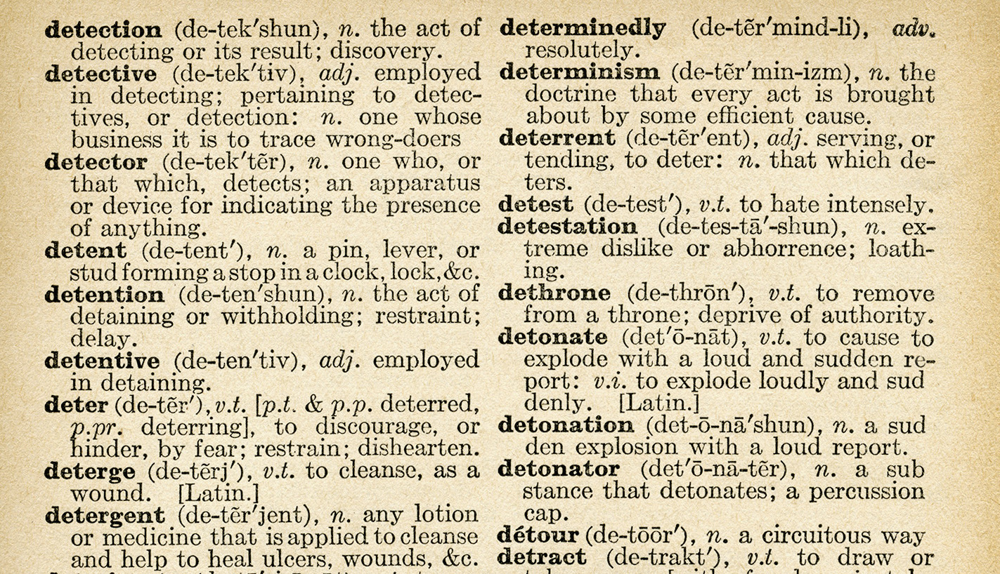

<!-- .slide: id="lesson7" -->

# Basic Frontend - Fall 2022

Lesson 7, Thursday, 2022-10-13

---

### `let` vs `const` vs `var`

So far, we **defined** variables using the `let` keyword. `const` defines a **constant**, which means that the value cannot be changed:

```js
const x = 42;
x = 43; // error
```

The `var` keyword is *old* JavaScript. It is not recommended. Use `let` instead.

---

### Comments

In JavaScript (and in programming in general) comments are short texts to add explanations to our code.

Comments are meant only for developers of the code.

They are ignored by JavaScript:

```js
// Average: divide the sum of a set of numbers by the number of values
// for example, if we have 4 numbers, we have to divide the sum by 4
let average = (2 + 6 + 3 + 9) / 4;
```

---

### Commenting our code

Two types of comments:

```js
// this is a one line comment
// another one line comment
// anything after // is ignored by JavaScript

/*
    This is
    a multi-line
    comment
*/

let a = 5; // I can put comments mostly everywhere
```

- Use comments to add important information that is not already clear from reading the code.
- Good comments explain the **why** and not the **what**

---

### Comments

Also commonly used to **temporarily** remove code that may be problematic, or just not necessary right now.

```js
function checkTemperature(temperature) {
  if (temperature > 20) {
    console.log("I'm comfortable");
  } else {
    // HEATER IS BROKEN, leave alone for now.
    // turnOnHeat();
    console.log("It's cold!");
  }
}

```

---

### Data Type: Undefined

* **Undefined** has only one value: `undefined`
* It indicates the unintentional absence of any value
* `undefined` is automatically assigned to variables
* `undefined` is automatically returned by functions without a `return` statement

---

### Undefined example

```js
let x;  // no value is assigned to x
console.log(x); // undefined
console.log(typeof x); // "undefined"
console.log(x === undefined); // true

function silly() { /* no return statement */ }
let y = silly(); // y is undefined
```

---

### Compound assignment operators

| Compound operator | Same as |
| ----------------- | ------  |
| `x += 42` | `x = x + 42` |
| `x -= 42` | `x = x - 42` |
| `x /= 42` | `x = x / 42` |
| `x *= 42` | `x = x * 42` |
| `x **= 42` | `x = x ** 42` |

Compound assignment operators are shorter ways of applying an operator on the variable and assigning the result back to the variable.

---

<!-- .slide: id="objects" -->

# Objects

---

### Problem with simple values

Let's imagine you need to describe three friends:

```js
let friend1Name = "Alice";
let friend1Age = 30;
let friend2Name = "Bob";
let friend2Age = 35;
let friend3Name = "Carol";
let friend3Age = 42;
```

We need _a lot_ of variables.

---

### Problem with function parameters

Now imagine a function that operates on 2 people:

```js
function introduce(person1Name, person1Age, person2Name, person2Age) {
  console.log("Hello, I am " + person1Name + ", I am " + person1Age + " years old.");
  console.log("Hello" + person1Name + ", my name is " + person2Name + ", I am " + person2Age + " years old.");
}
```

The parameter list gets rather long, and if you'd like to introduce another variable, it gets messy.

---

Wouldn't it be nicer if we could group information that belongs together somehow?

---

### Objects

An **object**, in Javascript, is a group of *key* / *value* pairs

We can think of key/value pairs as words in a dictionary

* a word is the **key**
* the definition is the **value**

 <!-- .element width="500" style="display: block; margin: 0 auto;" -->

---

### Objects

Basic example of an object

```js
let person = {
  firstName: 'Owen',
  age: 30,
  isProgrammer: true 
};
```

---

### Objects

key/value pairs are also referred to as **properties**

```js
let person = {
  firstName: 'Owen', // comma 
  age: 30,           // comma 
  isProgrammer: true // comma is optional
};
```
* can you name all the properties in this **person** object?
* and its keys?
* and its values?

---

### Objects: examples

```js
let book = {
  title: 'The Lord of the Rings',
  author: 'J. R. R. Tolkien',
  publicationYear: 1954,
  pages: 1216
};
```

---

### Objects: examples

```js
let car = {
  make: 'Volkswagen',
  model: 'Golf',
  modelYear: 2005,
};
```

---

### Task: Introduction

Define a variable called `me` and initialize it with an object containing the following information about you:

* name
* favorite food
* hair color
* eye color

---

### Objects: accessing properties

Now we know how to create objects, what can we do with it?

```js
let friend = {
    name: "Alice",
    age: 30
};

// we can access the value of a property using the "." operator
let friendName = friend.name; // friendName points to "Alice"
console.log(friendName + " is my friend.");

// we can also change the value
friend.age = 31;
console.log("She is " + friend.age + " years old.")
```

---

### Objects: accessing properties

```js
let book = {
  title: 'The Lord of the Rings',
  author: 'J. R. R. Tolkien',
  publicationYear: 1954,
  pages: 1216
};

console.log(book.title + " was written by " + book.author);
```

---

### Objects: accessing properties

```js
let car = {
  make: 'Volkswagen',
  model: 'Golf',
  modelYear: 2005,
};

if (car.modelYear > 2000) {
  console.log('The car is relatively modern.')
} else {
  console.log('The car is rather old.')
}

```

---

### Task: part 1

Start with the `me` object you created in the earlier task that contains your name and favorite food.

Write a function that takes that object as a parameter and introduces that person using `console.log`.

Example output:

```js
introducePerson(me);
// "Hi, my name is Owen and my favorite food is curry"
```

---

### Task: part 2

Now create another object called `friend` with the same properties as `me`.

Introduce your friend using the same function you created in part 1.

Example output:

```js
introducePerson(friend);
// "Hi, my name is Harald and my favorite food is pizza"
```

---

### Task: part 3

Create a function that takes two "person" objects. Compare their ages, then use `console.log` to print who is older of the two.

You may need to first add an "age" property to your objects if you don't have it already.

Example output:

```js
whoIsOlder(me, friend);
// "Harald is older"
```

---

### Object Properties

So objects consist of key-value pairs (also called properties).

Keys point to values.

```js
let me = {
  firstName: 'Owen', 
  age: 30,
  isProgrammer: true
};
```

So far, we've used strings, numbers, and booleans as possible values. What else could we use?

---

```js
let me = {
    firstName: "Owen",
    address: {
        street: "Invalidenstraße",
        city: "Berlin"
    }
};
```

How many properties does the object above have? How can you access the `city` in the `me` variable above?

```js
let myCity = me.address.city;
```
<!-- .element: class="fragment" -->

---

```js
let me = {
    name: "Harald",
    greeting: function() {
        if (dayOfWeek === "Monday") {
            return "Get out of my face";
        } else {
            return "Hi, how are you?";
        }
    }
};
```

How would you call the greeting function?

```js
let greeting = me.greeting();
```
<!-- .element: class="fragment" -->

---

### Methods

A function inside an object is also called **method**:

```js
// I am a function!
function sayHi() {
  return "Hi!";
}

let me = {
    // I'm a method!
    sayHi: function() {
      return "Hi!";
    }
};
```

---

### What is console.log?

You've been using objects and methods this whole time!

`console` is a "global" object, and `log` is a method belonging to `console`.


---

### Practice

Using your "me" object, create a method to introduce yourself (using console.log). Create a object within that represents your address.

```js
me.introduce();
// "Hi, my name is Owen"
console.log(me.address.city); // "Berlin"
console.log(me.address.country); // "Germany"
```

---

### Variable lifetime

```js
console.log(x); // 1
function myFunction() {
    console.log(x); // 2
    let x = 42;
    console.log(x); // 3
}
console.log(x); // 4
```

Which of the `console.log` above are valid?

Only 3. 1, 2, and 4 throw errors.
<!-- .element: class="fragment" -->

---

### Variable lifetime

When you open a scope with `{`, e.g. for `if` statements or `function`, the variables you define inside the curly braces only exist within that block.

Variables you define outside any curly braces exist during the entire lifetime of your html page:

```js
// I exist as long as the html page exists!
let clickCount = 0;

function onButtonClick() {
    clickCount += 1;
}
```