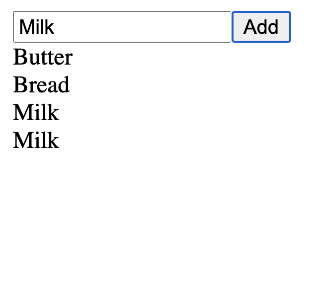

<!-- .slide: id="lesson12" -->

# Basic Frontend - Fall 2022

Lesson 12, Tuesday, 2022-11-08

---

### Lesson overview

* FizzBuzz
* Recap
* create new HTML Elements

---

### FizzBuzz

```js
for (let i = 0; i <= 100; i++) {
    if (i % 3 === 0 && i % 5 === 0) {
        console.log("FizzBuzz");
    } else if (i % 3 === 0) {
        console.log("Fizz");
    } else if (i % 5 === 0) {
        console.log("Buzz");
    } else {
        console.log(i);
    }
}
```

Can we do better?
<!-- .element: class="fragment" -->

---

```js
for (let i = 0; i <= 100; i++) {
    if (i % 15 === 0) {
        console.log("FizzBuzz");
    } else if (i % 3 === 0) {
        console.log("Fizz");
    } else if (i % 5 === 0) {
        console.log("Buzz");
    } else {
        console.log(i);
    }
}
```

Can we do better?
<!-- .element: class="fragment" -->

---

```js
for (let i = 0; i <= 100; i++) {
    let multipleOf3 = i % 3 === 0;
    let multipleOf5 = i % 5 === 0;
    if (multipleOf3 && multipleOf5) {
        console.log("FizzBuzz");
    } else if (multipleOf3) {
        console.log("Fizz");
    } else if (multipleOf5) {
        console.log("Buzz");
    } else {
        console.log(i);
    }
}
```

Can we do better?
<!-- .element: class="fragment" -->

---

```js
for (let i = 0; i <= 100; i++) {
    let output = "";
    if (i % 3 === 0) {
        output += "Fizz";
    }
    if (i % 5 === 0) {
        output += "Buzz";
    }
    console.log(output || i);
}
```

Can we do better?
<!-- .element: class="fragment" -->

---

```js
function fizzBuzz(i) {
    // ... one of the solutions found above
}

for (let i = 0; i <= 100; i++) {
    let output = fizzBuzz(i);
    console.log(output);
}
```

---

### Want more?

https://rosettacode.org/wiki/FizzBuzz

---

### Recap

---

### getElementById

HTML:
```html
<div id="myDiv"></div>
```

How do we add content to this div?

JS:
```js
let myDivElement = document.getElementById("myDiv");
myDivElement.textContent = "Hello world!";
```

---

HTML:
```html
<input id="myInput">
```

JS:
```js
let myInputElement = document.getElementById("myInput");
```

What JavaScript code do I need to write to change the input element to:

```html
<input id="myInput" type="number">
```

---

```js
let myInputElement = document.getElementById("myInput");
myInputElement.type = "number";
```

---

### Another example

HTML:
```html
<input id="myInput" type="number" min=0 max=99 placeholder="Amount">
```

JS:
```js
let myInputElement = document.getElementById("myInput");
myInputElement.type = "number";
myInputElement.min = 0;
myInputElement.max = 99;
myInputElement.placeholder = "Amount";
```

---

### Setting onclick in javascript?

HTML

```html
<button id="myButton" onclick="myFunction()">Click me!</button>
```

How can we set the `onclick` property from JavaScript?

```js
let myButtonElement = document.getElementById("myButton");
// ???
```

---

### Variables pointing to functions

So far, we learned that variables can point to values:

```js
let age = 42;
let name = "Otto";
let isHappy = true;
let address = {
    street: "Ottostr.",
    city: "Berlin"
};
```

---

### Functions can be values, too

Variables can also point to functions:

```js
let myFunction = function() {
    console.log("this function was called");
};
// myFunction is a variable pointing to our function
myFunction(); // calls the function above
```

The function above is also called an "anonymous" function, because the function
itself has no name.

---

### Syntax comparison

```js
function myFunction(name) {
    console.log("Hi " + name);
}
let myFunction2 = function(name) {
    console.log("Hi " + name);
}
myFunction("Owen"); // "Hi Owen"
myFunction2("Harald"); // "Hi Harald"
```

---

HTML

```html
<button id="myButton">Click me!</button>
```

How can we set the `onclick` property from JavaScript?

```js
let myButtonElement = document.getElementById("myButton");
myButtonElement.onclick = function() {
    console.log("My button was clicked");
}
```

---

So far, we can get elements from HTML and manipulate them.

* We can set and get properties
* properties can be numbers, strings, booleans, object, functions...
* But what if we want to create a new element that's not in HTML yet?

---

<!-- .slide: id="create-element" -->

### document.createElement

Basic usage:
```js
let myDiv = document.createElement("div");
```

However, we need to do a bit more configuration to have something useful.

---

```js
let myDiv = document.createElement("div"); // 1
myDiv.textContent = "hello";               // 2
document.body.appendChild(myDiv);          // 3
// <div>hello</div> has been added to the page!
```

1. Create a new HTML element using `document.createElement`. Pass the type of the element (`div`, `button`, `img`, ...) as string.
2. Set all the properties you like, e.g. `textContent`, `onclick`, ...
3. `appendChild` add an element to the end of the list of children of a specific parent element. Here, we append it to the document's `<body>`.

---

### .appendChild()

What is the function `appendChild`?
```js
document.body.appendChild(myDiv);
```

Remember our `<body>` tag in the html? `document.body` refers to that element, it is mostly just like any other HTML element. Content within here is what the user sees in their browser

`appendChild` means to "add within this element", and it is the best way to add new elements to the page. `appendChild` can be called on almost any element.


---

### Task 1: Appending elements

Let's say you have this HTML:

```html
<div id="myDiv"></div>
```

How do you turn it to this from JavaScript?

```html
<div id="myDiv">
    <span>Hello</span>
</div>
```

* Hint: Use `document.getElementById`, `document.createElement`, the `textContent` property and `appendChild`.

---

### Task 2: Creating elements in a loop

Use a for loop and createElement to generate the following HTML on your page:

```html
<div>Element 1</div>
<div>Element 2</div>
<div>Element 3</div>
<div>Element 4</div>
<div>Element 5</div>
```

---

### Task 2 bonus

Create a button at the top of the page that generates a new element in sequence when clicked, so  "Element 6", "Element 7", and so on.

---

### Task 3: Create a shopping list app!

It should have one `<input>` field where the user can enter a shopping item. It should have one `<button>`. When the user clicks the button, the text from the `<input>` field should be appended to the shopping list.

 <!-- .element width="250px" style="display: block; margin: 0 auto;" -->

---

### Bonus (difficult!!!)

When the user clicks on a shopping item, remove it from the page.

* Hint: set an `onclick` function on your newly created HTML element.
* Hint: use the `remove()` method of your item to remove it.
